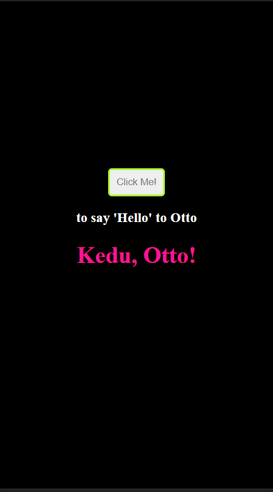

# Hello React App

Hello React App demonstrates the use of the [hello-rails-api](https://hello-rails-api.herokuapp.com/api/v1/greetings).

## Screenshots

> ||

## Built With
- JavaScript/React
- Redux
- React Router
- JSX
- CSS
  
## Setup
- Get the link of the repository: [https://github.com/chaw-bot/hello-rails-react](https://github.com/chaw-bot/hello-react-front-end)
- Clone it as `git@github.com:chaw-bot/hello-react-front-end.git` on a Terminal
- Usage
- Run `npm install`
- Run `bundle install` on a Terminal to install the modules
- Start the server by running `npm start`
  
## Author

👤 **Chawanzi Ng'uni**

- GitHub: [@chaw-bot](https://github.com/chaw-bot)
- Twitter: [@chaw](https://twitter.com/chawfronaut)
- LinkedIn: [Chawanzi Ng'uni](https://www.linkedin.com/in/chawanzi-ng-uni-449328212/)

## 🤝 Contributing

Contributions, issues, and feature requests are welcome!

Feel free to check the [issues page](https://github.com/chaw-bot/hello-react-front-end/issues).

## Show your support

Give a ⭐️ if you like this project!

## Acknowledgments
- Microverse
- Ruby documentation
- Stack Overflow